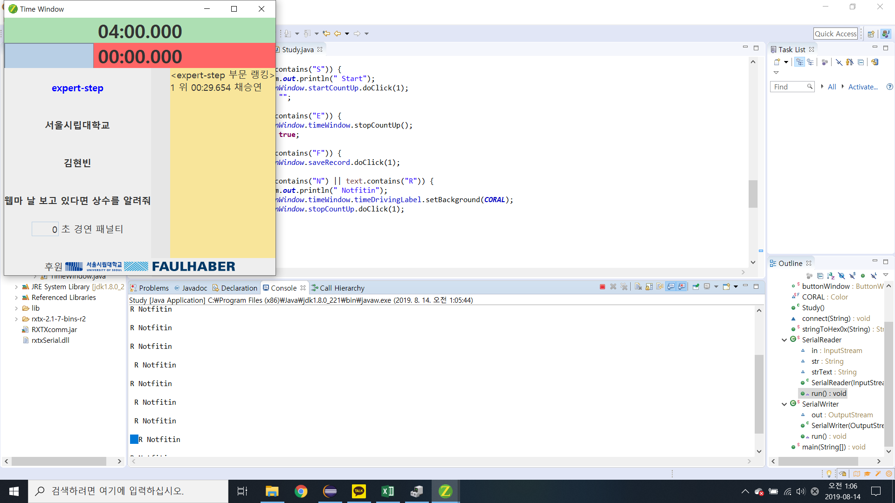

# ZETIN-time-counter
 This is a time counting & record managing program for 2019 Smart Robot Festival in Univ. of Seoul

# Time Counter 계수기

라인트레이서 경연대회에서 선수/로봇의 기록 측정과, 기록 관리 및 랭킹 관리, 나아가 대회의 흐름 안내 등의 기능을 담당하는 프로그램이다. 대회 개최 시, 대회장 스크린에 크게 나타나며 현재 선수의 기록, 다음 선수, 현재 랭킹 등의 정보를 보기 쉽게 나타내고, 각종 정보들을 수동으로 조작할 수 있는 조작메뉴도 존재한다. 대표적인 기능은 아래와 같다.

* 4분 경연시간 (남은 시간 보여주기, 일시정지, 재개, 강제중단, 상태에 따른 배경색 변경, 시작 및 종료 알림음, 패널티, 원하는 시간 설정하기)
* 주행시간 (arm에서 신호 받아 시작 및 중단, 기록 강제 종료, 상태에 따른 배경색 변경, 기록이 현재 몇 위인지에 따른 배경색 변경, 패널티)
* 현재 선수 정보
* 현재 선수 레코드 오름차순으로 정렬해서 보여줌.
* 현재 부문의 순위 (시간과 이름) 오름차순으로 정렬해서 보여줌
* 아래 후원사 로고 표시
* 컴포넌트(타이머, 선수 정보, 후원사 등 글자 크기) 크기 변경 기능
* 개인기록 추가/제거 (랭킹에도 추가/제거 기능)
* 현재 부문 명단과 다음 선수 알려주기 
* 현재 선수의 최종기록 보여주기

[대회장 사진 링크](https://zetin.uos.ac.kr/index.php?mid=photo&document_srl=493724)

# 계수기 환경

arm mcu(STM32F407)이 부착된 시간 측정 장비가 있다. 이 장비와 시리얼 통신하며 기록(시간)의 정보를 읽어온다. 읽어온 정보는 현재 순서의 선수의 정보에 자동으로 등록된다. 선수들의 참가순서는 엑셀파일에 미리 정의되어 있어서 이 파일을 읽는다. 선수 전환은 수동조작으로 해준다.

# 여담

이 코드는 2019년 여름에 제작된 것이다. 2021년 가을에 되어서야 코드를 올린다. 그 사이 최종 코드가 유실된 것 같다. (이 코드는 최종본이 아니다.)작업 중에 있던것 같은코드를 발견하여 더 늦기 전에 올린다. 작업물 보존의 중요함을 다시금 깨달았다. 아래는 정체불명(?)의 오류 사진을 첨부한다. 왜 발생한지 모르는 오류이다. (붉은 바탕의 레이블 왼쪽에 연하늘? 연회색의 박스가 생겼다.) 2년이 지난 지금에 생각해보니 visibility나 background color를 너무 빈번하게 바꿨을 때 발생하는 문제 같기도 하다.

